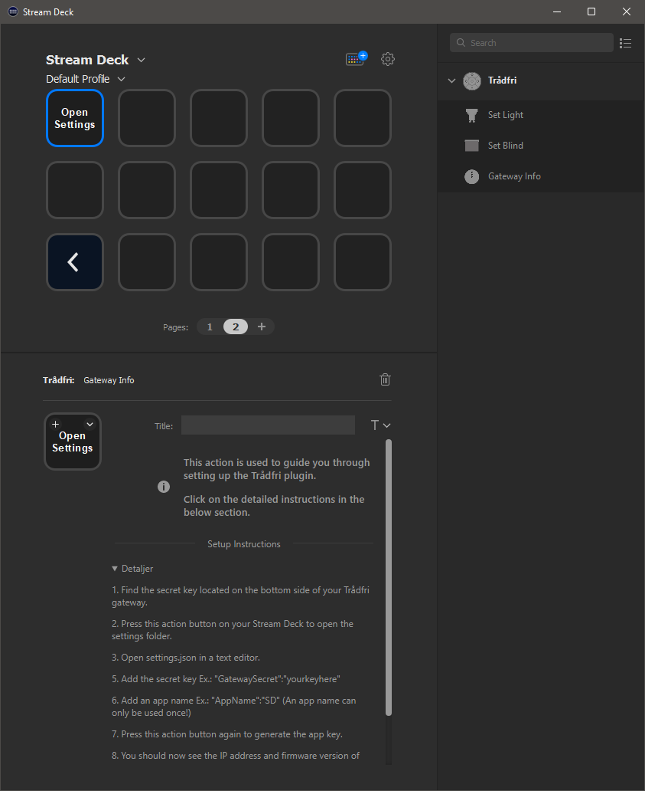
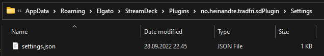
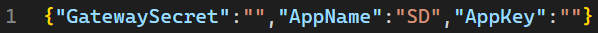
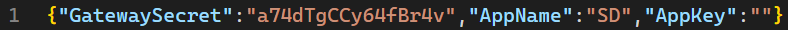
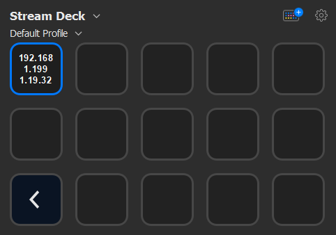
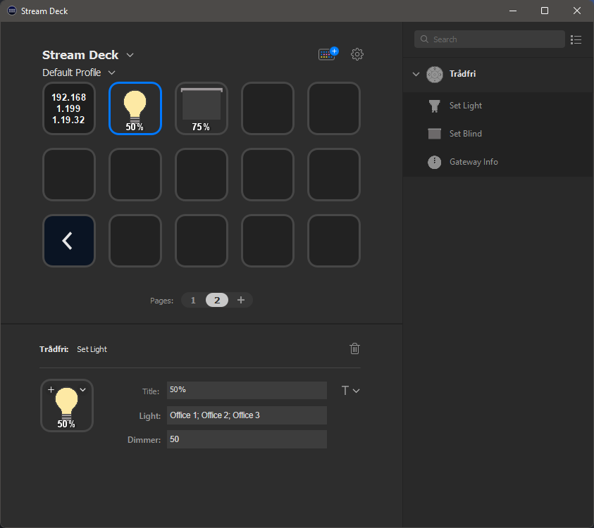
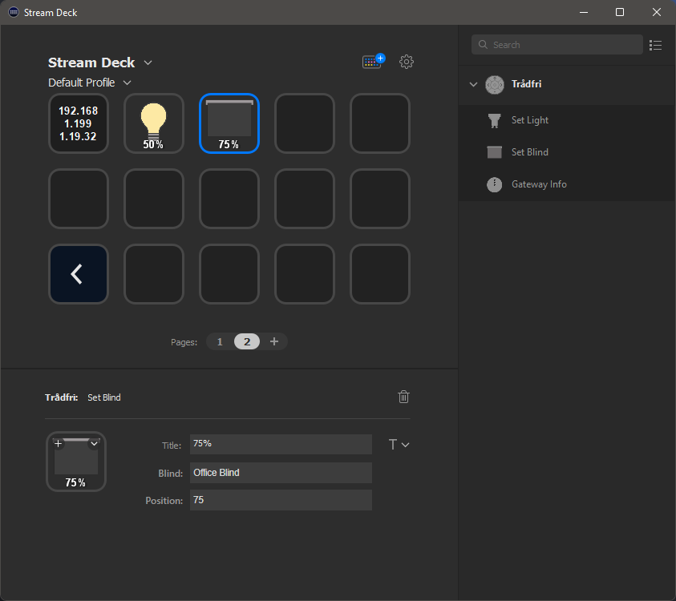

# IKEA Trådfri Stream Deck Plugin

This is an IKEA Trådfri Plugin for the Elgato Stream Deck. This plugin connects your Elgato Stream Deck to your IKEA Trådfri Gateway and lets you control your devices.

## Supported Devices & Actions

- [x] Lights
  - Turn ON/OFF or dim your lights
- [x] Blinds
  - Adjust your blinds to any position

## Installation

- Download a release from the release section
- Extract the release
- Place the `no.heinandre.tradfri.sdPlugin` folder inside the Stream Deck plugins folder
- Fully close and restart the `Stream Deck` application

### Plugin Folders

- **Windows**: `%appdata%\Elgato\StreamDeck\Plugins\`
- **macOS**: `~/Library/Application Support/com.elgato.StreamDeck/Plugins/`
  - ***⚠️ NOTE!*** This plugin has ***NOT*** been tested on macOS!

## Setup

After adding the plugin to the plugin directory you should be able to see the new actions in the list of installed plugins.

Use the `Gateway Info` action to set up the plugin. There is a detailed instruction in the properties section. You can press the `Gateway Info` action button on your Stream Deck to open the settings folder.

The following folder should open:

Open the `settings.json` file.

We need to provide two settings to connect the plugin to your IKEA Trådfri Gateway. The first setting is `GatewaySecret` which you can find printed at the bottom of your gateway.

The `AppName` setting is set to `SD` as default. You can use `SD`, but keep in mind that you can't reuse the app name.

***⚠️ If you lose your generated `AppKey` you have to specify a different `AppName` to generate a new `AppKey`.***

Save the `settings.json` file and press the `Gateway Info` action button on your Stream Deck (or restart the Stream Deck application) to complete the setup. Give it some time to register the `AppName` and receive the `AppKey`.

If the settings are correct, the `Gateway Info` action button should now show the IP address and the firmware version of your Trådfri Gateway.

***ℹ️ You can make a backup of the `settings.json` file or extract your `AppKey` from the file at this point if you want to back it up for later.***

***✅ You may now add other actions to control your devices!***

*An example showing how to make an action that dims one or more lights to the desired level:*

*Controlling Blinds work in a very similar way:*

## Development

This plugin is based on the [StreamDeckToolkit Plugin Template by @FritzAndFriends](https://github.com/FritzAndFriends/StreamDeckToolkit).

More information here:
- GitHub: https://github.com/FritzAndFriends/StreamDeckToolkit
- Docs: https://fritzandfriends.github.io/StreamDeckToolkit/
